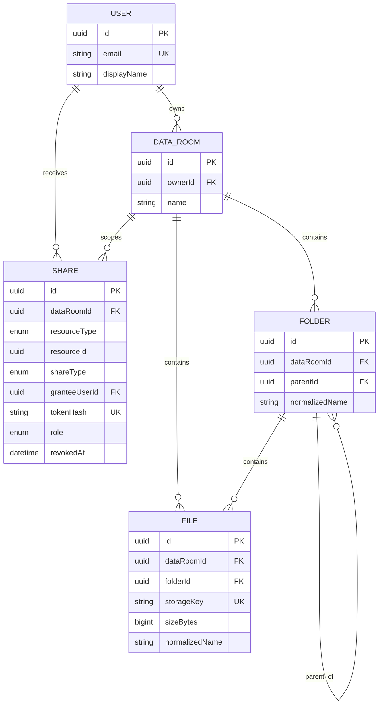

# Acme Data Room

A full-stack, private-by-default workspace for due-diligence documents. Owners can organise PDFs into nested folders, preview them in the browser, and grant view-only access either to a registered user or through a revocable public link.

## Status and hosted URLs

The application is ready to deploy. Public URLs are intentionally not listed yet because this repository has not been connected to the owner’s Vercel and API-hosting accounts. Follow the deployment notes below after connecting those accounts; do not substitute placeholder URLs in a take-home submission.

## What is included

- Email/password authentication through Supabase Auth.
- Private Data Rooms, visible only to their owner unless shared.
- Nested folders, breadcrumbs, rename, and recursive delete confirmation.
- Multi-file PDF upload through direct signed uploads to a private Supabase Storage bucket, with per-file progress and a 50 MB limit.
- In-app PDF preview, rename with automatic conflict resolution, move, and delete.
- Read-only public links and permissioned shares for registered users; the owner can revoke either.
- A dedicated public, view-only route for link recipients.
- Live Supabase-backed e2e coverage for core security and data-integrity flows.

## Stack

| Layer | Choice |
| --- | --- |
| Web | Next.js (App Router), React, TypeScript, Tailwind CSS |
| API | NestJS, TypeScript, Prisma |
| Database | Supabase PostgreSQL |
| Authentication | Supabase Auth (email/password) |
| Object storage | Private Supabase Storage bucket |
| Testing | Jest and Supertest against a dedicated, cleaned-up Supabase test run |

## Architecture

```text
Next.js browser app
  |  Supabase session / Bearer token
  v
NestJS API ─── verifies identity with Supabase Auth
  |                 |
  |                 +── Prisma ──> PostgreSQL metadata
  |
  +── service-role signed upload/download URLs ──> private Storage bucket
```

The browser never receives the Storage service-role key. An owner first asks the API for an upload intent, uploads directly to the private bucket, then completes the metadata record through the API. A file is only recorded after the API confirms the expected object exists.

## Data model / ERD



`Share.resourceType` plus `Share.resourceId` is a deliberate polymorphic scope: a share can point at a room, a folder, or a file without separate share tables. `role` already supports `VIEWER` and `EDITOR`, while this MVP exposes `VIEWER` only. Folder and file names are unique per parent scope, including the root, using a normalized name and a root sentinel.

## Local setup

### Prerequisites

- Node.js 20 or later and npm.
- A Supabase project with Auth, PostgreSQL, and Storage enabled.
- A private Storage bucket named `data-room-files` (or a different name supplied through the API environment variable).

### Configure environment

```powershell
Copy-Item apps/api/.env.example apps/api/.env
Copy-Item apps/web/.env.example apps/web/.env.local
```

Configure `apps/api/.env`:

| Variable | Purpose |
| --- | --- |
| `DATABASE_URL` | Supabase PostgreSQL connection string used by Prisma. |
| `SUPABASE_URL` | Supabase project URL. |
| `SUPABASE_ANON_KEY` | Public browser/Auth key used to validate user sessions. |
| `SUPABASE_SERVICE_ROLE_KEY` | Server-only key for Auth admin lookups and Storage signing; never expose it to Next.js. |
| `SUPABASE_STORAGE_BUCKET` | Private bucket name, normally `data-room-files`. |
| `FRONTEND_URL` | Comma-separated allowed browser origins for API CORS. |
| `SIGNED_URL_TTL_SECONDS` | Lifetime for download URLs; defaults to 300. |

Configure `apps/web/.env.local`:

| Variable | Value |
| --- | --- |
| `NEXT_PUBLIC_API_URL` | API origin, such as `http://localhost:4000`. |
| `NEXT_PUBLIC_SUPABASE_URL` | The same project URL as the API. |
| `NEXT_PUBLIC_SUPABASE_ANON_KEY` | The public Supabase anon key only. |

Enable email/password sign-in in Supabase Auth. A permissioned recipient must already have a Supabase Auth account; the API safely provisions its local profile on first share.

### Install, migrate, and run

```powershell
npm install
npx prisma generate --schema apps/api/prisma/schema.prisma
npx prisma migrate deploy --schema apps/api/prisma/schema.prisma
npm run build --workspace=@acme/data-room-api
npm run start --workspace=@acme/data-room-api
```

In a second terminal:

```powershell
npm run dev --workspace=@acme/data-room-web
```

Open `http://localhost:3000`. The API defaults to `http://localhost:4000`.

## Verify

```powershell
npm run build --workspace=@acme/data-room-api
npm run build --workspace=@acme/data-room-web
npm run test:e2e --workspace=@acme/data-room-api
```

The e2e suite creates isolated Auth users and data tagged for its run, exercises real PostgreSQL and Storage, and removes its users, data rooms, and uploaded objects in teardown. It covers nested breadcrumbs, read-only sharing, revocation, public subtree boundaries, recursive deletion, production-safe errors, and same-name upload resolution.

## How it scales

### Folder subtree size and item count

The MVP uses a recursive query to obtain descendant folders and aggregates their file metadata for the delete warning. This keeps the source of truth in the normalized tree and guarantees that the warning describes the subtree being deleted.

For frequently displayed folder totals or very large trees, add a `folder_aggregates` projection (`descendantFolderCount`, `descendantFileCount`, `totalBytes`) and update every ancestor in the same write transaction. A periodic reconciliation job can repair aggregates after operational failures. An alternative for arbitrary deep-tree queries is a closure table; the current adjacency list keeps ordinary creation, rename, and browsing straightforward for the MVP.

### One Data Room with 100,000 files

The API already limits folders and files independently and returns cursors; the web interface exposes a “Load more” control. At higher scale, make the cursor a true `(name, id)` keyset rather than a primary-key cursor with a sort, and add matching composite indexes for the list order (for example, room/folder/name/id). Keep the response narrow, fetch only a page at a time, and avoid recursive expansion during ordinary browsing. Search should use a room-scoped indexed normalized name or PostgreSQL trigram/full-text index, depending on the matching experience required.

### Per-user roles without remodelling

`Share` already has a `role` enum. Add an `assertCanEdit` branch to the central access-control service and allow owner-or-editor mutations through it; existing room/folder/file scopes, public-token hashing, revocation, and inheritance remain unchanged. Public links should remain viewer-only regardless of future editor roles.

## Deployment

1. Apply the Prisma migration to the production Supabase project and create the private Storage bucket.
2. Deploy `apps/web` to Vercel. Set all `NEXT_PUBLIC_*` variables, including the final API URL.
3. Deploy `apps/api` to a Node-compatible host such as Render, Railway, or Fly.io. Set the API environment variables and `FRONTEND_URL` to the final Vercel origin.
4. Add the Vercel origin to Supabase Auth redirect/CORS settings if required by the Auth configuration.
5. Run the e2e suite against an isolated test project or test-specific credentials, then manually check sign-in, upload, a public link, and a revoked link.

## Future improvements and intentional MVP boundaries

- Invite an email address that is not registered yet, with a secure acceptance flow. Today, permissioned sharing intentionally works only for registered users, so the recipient identity is explicit and access remains revocable.
- Add expiry dates, password protection, audit events, and download policy controls for external links.
- Wire the existing `EDITOR` role into the authorization checks and UI.
- Add room-scoped name search/filtering and optional file versions on conflict.
- Add resumable uploads, virus scanning, richer file types, and background preview generation.
- Add UI tests and a deploy-time health check.

## AI use

AI was used as a pair-programming assistant for initial scaffolding, component and test drafting, and documentation structure. All generated code was reviewed, adjusted against the stated requirements, compiled locally, and exercised by the live e2e suite. No secrets are embedded in source control.

For implementation-level maintenance notes, see [the developer overview](docs/data-room/overview.md).
